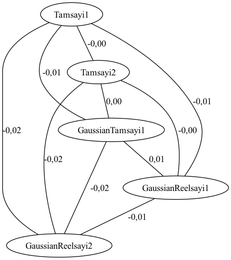

# java-numerical-data-similarity 🚀

> Java ile rastgele sayısal veri üretimi, korelasyon analizi ve Graphviz görselleştirmesi.

---

## 🎯 Proje Hakkında

Bu proje, **istatistiksel veri üretimi** ve **veri benzerliği analizi** için küçük ama etkili bir araçtır.  
- Gaussian ve rastgele sayılarla veri üretir  
- SQLite veritabanına kaydeder  
- Pearson korelasyon katsayılarını hesaplar  
- `similarity` tablosuna yazar  
- Graphviz ile `.dot` dosyası üretir

---

## ⚙️ Özellikler

- ✅ Gaussian & rastgele sayı üretimi  
- ✅ Pearson korelasyon matrisi  
- ✅ SQLite veritabanı kullanımı  
- ✅ Graphviz ile görselleştirme  
- ✅ Kolayca genişletilebilir yapı

---

## 🚀 Kurulum ve Çalıştırma

### 1. Gereksinimler

- Java 17+ (JDK 21 önerilir)  
- [sqlite-jdbc](https://github.com/xerial/sqlite-jdbc) JAR dosyası  
- Graphviz (görselleştirme için)

### 2. Derleme

```bash
javac -cp ".:sqlite-jdbc-3.45.1.0.jar" src/com/crud/Main.java -d target/classes
```

### 3. Çalıştırma

```bash
java -cp "target/classes:sqlite-jdbc-3.45.1.0.jar" com.crud.Main
```

---

## 📈 Graphviz ile Görselleştirme

```bash
dot -Tpng correlation.dot -o correlation.png
open correlation.png  # (macOS kullanıcıları için)
```

Alternatif: [Graphviz Online Viewer](https://dreampuf.github.io/GraphvizOnline/)

### Örnek Görsel

Aşağıda, oluşturulan `correlation.png` dosyasının örnek bir görünümü yer almaktadır:



---

## 📊 Örnek Çıktılar

```
Kolonlar arası korelasyon hesaplandı.
Veri üretildi ve kaydedildi.
```

- `data.db` içinde `records` ve `similarity` tabloları
- `correlation.dot` → bağlantılar
- `correlation.png` → grafik çıktısı

---

## 📂 Proje Yapısı

```
├── src/
│   └── com/crud/Main.java        # Ana kaynak kodu
├── target/classes/               # Derlenmiş Java sınıfları
├── data.db                       # SQLite veritabanı (oluşturulur)
├── correlation.dot               # Graphviz için çıktı
└── correlation.png               # Grafik dosyası (manuel oluşturulur)
```

---

## 💡 Geliştirme Fikirleri

- 🔁 Farklı korelasyon metrikleri (Spearman, Kendall)
- 📊 Daha büyük veri setleri
- 🌐 Basit web arayüzü (Spring, JavaFX, vs.)
- 🧪 Test sınıfları ve grafik karşılaştırmaları

---

## 🤝 Katkı

Pull request, fork ve yıldız ⭐ her zaman hoş karşılanır!

---

## 🧾 Lisans

MIT License © 2025 [Ceyhun Emre TOP](https://github.com/Ceyhunemre0)

---

> Kodlama tutkuyla yapılır, grafiklerle anlam bulur. 🎯